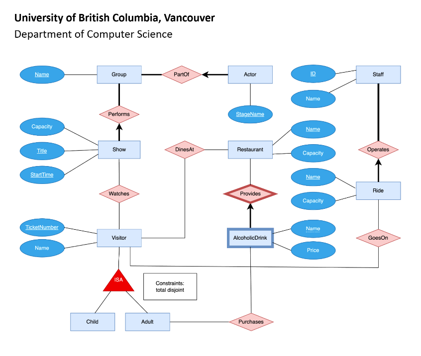

# Amusement Park DB

Our final project was an amusement park system using Oracle Database and PHP. It accomplishes the task of gathering critical information for the administrators of an amusement park to analyze the ongoings of the park in order to make adjustments according to presented numbers and data, and managing some parts of the system. For example, the project is able to add new entries to the list of all restaurants, viewing the total list with drinks associated, if the amusement park decides to open up new restaurants, and delete restaurants as well. Also, a user can check the amusement park’s restaurant list to see which ones fall under a specific capacity range if there will be certain events that require a select number of seats. 

## ER Diagram

## Sections: 
The queries are grouped by which member was in charge, which is why there are four different pages as seen in the top menu bar. Each page however, serves a specific purpose and so they can be thought of as grouped into specific intentions. For example, Insert&DeleteRestaurants is for controlling the amusement park's restaurants and checking drinks. 
1. AmusementPark: Hailey 
2. Insert&DeleteRestaurants: Madeline
3. Projection&HavingShows: Madeline
4. Update&Join: Sophia

